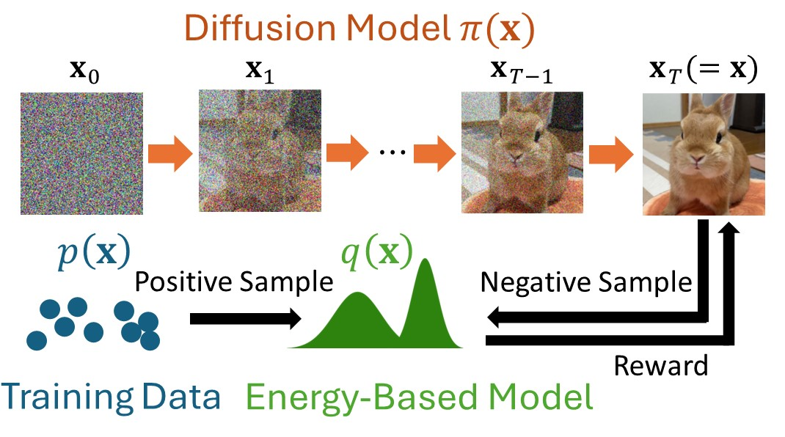

# Diffusion-by-MaxEntIRL

The official code release of  
**Maximum Entropy Inverse Reinforcement Learning of Diffusion Models with Energy-Based Models**

Sangwoong Yoon, Himchan Hwang, Dohyun Kwon, Yung-Kyun Noh, Frank C. Park   
**NeurIPS 2024 Oral Presentation**  
arxiv: https://arxiv.org/abs/2407.00626



## Environment

* python >= 3.8
* pytorch >= 2.0
* cuda >= 11.6

We recommend using Conda for setting up the environment.

```
conda create -n dxmi python=3.8
conda activate dxmi
# install your version of PyTorch
pip install ...
# install other dependencies
pip install -r requirements.txt
```


## Unit tests

```
python -m pytest tests/
```

## TODO & Status

- [x] CIFAR-10 DDPM 
- [x] CIFAR-10 DDGAN
- [x] ImageNet64
- [x] LSUN Bedroom
- [x] FID Evaluation
- [ ] 2D  
- [ ] Anomaly Detection


## Datasets

```
datasets
├── cifar-10-batches-py
├── cifar10_train_png
├── cifar10_train_fid_stats.pt
├── imagenet  # corresponds to ILSVRC/Data/CLS-LOC/train
    ├── n01734418
    ├── ...
├── lsun_bedroom_train
└── mvtec
    ├── train_data.pth
    └── val_data.pth
```

Dataset files are released in [dropbox link](https://www.dropbox.com/scl/fo/kk65utuwwirobbltha4oq/AFYUYYhqNZBq8FIr0VX8uPY?rlkey=vh90rf1o6vhsxmywbktsea3sf&dl=0)

**CIFAR-10**

We use CIFAR-10 dataset downloaded via PyTorch (`torchvision.datasets.CIFAR10`).

**ImageNet 64x64**

Currently, ImageNet is hosted by Kaggle. 
Please download the dataset from [Kaggle](https://www.kaggle.com/c/imagenet-object-localization-challenge/data).  

Directories of training images should be placed under `datasets/imagenet`. You may create a symbolic link as follows:

```
ln -s <PATH_TO_DOWNLOADED_IMAGENET>/ILSVRC/Data/CLS-LOC/train datasets/imagenet
```

`datasets/imagenet` should have directories like `n01440764`, `n01734418`, ... as subdirectories.

**LSUN Bedroom**

LSUN Bedroom dataset is prepared following the protocol of [Consistency Models](https://github.com/openai/consistency_models/tree/main/datasets) repository. Extracted images are placed under `datasets/lsun_bedroom_train`.

## Model Checkpoints

Model checkpoints files can be found in [dropbox link](https://www.dropbox.com/scl/fo/ax2xaua6xpuvtfprwu1z8/AG9X-AJi7Fg9U17Ua16tq70?rlkey=5xhjrroyndjqm7ox2kd8fod37&dl=0)

Models checkpoints are supposed to be placed under `pretrained` directory. When fully equipped, the directory structure should be like the following:

```
pretrained
├── cifar10_ddpm  # DDPM checkpoint provided by FastDPM
├── cifar10_ddgan  # DDGAN checkpoint provided by DDGAN
├── cifar10_ddpm_dxmi_T10
├── cifar10_ddgan_dxmi_T4
├── imagenet64_edm  # EDM checkpoint for ImageNet 64x64 provided by Consistency Models
├── imagenet64_edm_dxmi_T10
├── imagenet64_edm_dxmi_T4
├── lsun_bedroom_edm  # EDM checkpoint for LSUN Bedroom provided by Consistency Models
├── lsun_bedroom_edm_dxmi_T4
```

## Training

The training scripts are invoked using `torchrun` command and supports multi-GPUs.

**CIFAR-10** 

* Training T=10 with DDPM backbone
```
$ CUDA_VISIBLE_DEVICES=0 torchrun --nproc_per_node=1 train_cifar10.py \
    --config configs/cifar10/T10.yaml --dataset configs/cifar10/cifar10.yaml
```
The number of GPUs can be changed by modifying `CUDA_VISIBLE_DEVICES` and `--nproc_per_node` arguments, as in the following example.

* Training T=4 with DDGAN backbone. 
```
$ CUDA_VISIBLE_DEVICES=0,1,2,3 torchrun --nproc_per_node=4 train_cifar10.py \
    --config configs/cifar10/T4_ddgan.yaml --dataset configs/cifar10/cifar10.yaml
```


**ImageNet 64x64 and LSUN Bedroom**

* Training T=10 on ImageNet 64x64 with EDM backbone
```
$ CUDA_VISIBLE_DEVICES=0 torchrun --nproc_per_node=1 train_image_large.py \
    --config configs/imagenet64/T10.yaml --dataset configs/imagenet64/imagenet64.yaml
```

* Training T=4 on ImageNet 64x64 with EDM backbone
```
$ CUDA_VISIBLE_DEVICES=0 torchrun --nproc_per_node=1 train_image_large.py \
    --config configs/imagenet64/T4.yaml --dataset configs/imagenet64/imagenet64.yaml
```

* Training T=4 on LSUN Bedroom with EDM backbone
```
$ CUDA_VISIBLE_DEVICES=0,1,2,3 torchrun --nproc_per_node=4 train_image_large.py \
    --config configs/lsun/T4.yaml --dataset configs/lsun/bedroom.yaml
```

## Generation

**CIFAR-10**

Run `generate_cifar10.py` for unconditional CIFAR-10 generation. This script automatically loads the config and the checkpoint and generate images. 

The script also reports FID evaluated using `pytorch_fid` package. However, the FID scores reported in the paper are computed using Tensorflow code. (See Evaluation)

```
CUDA_VISIBLE_DEVICES=0,1,2,3 torchrun --nproc_per_node=4 generate_cifar10.py --log_dir pretrained/cifar10_ddpm_dxmi_T10 \
--stat datasets/cifar10_train_fid_stats.pt -n 50000
```

This scripts saves 50,000 images in PNG format under `pretrained/cifar10_ddpm_dxmi_T10/generated` directory. The generated images can be compressed into npz format as follows:

```
python make_npz.py --dir pretrained/cifar10_ddpm_dxmi_T10/generated --out pretrained/cifar10_ddpm_dxmi_T10/generated.npz
```

**ImageNet 64x64 and LSUN Bedroom**

```
CUDA_VISIBLE_DEVICES=0,1,2,3 torchrun --nproc_per_node=4 generate_large.py --log_dir pretrained/imagenet64_edm_dxmi_T10 --n_sample 50000 --batchsize 100
```

For LSUN Bedroom, images are too large so that we can not store them in the GPU memory. Therefore, we need to set `--skip_fid` flag.

```
CUDA_VISIBLE_DEVICES=0,1,2,3 torchrun --nproc_per_node=4 generate_large.py --log_dir pretrained/imagenet64_edm_dxmi_T10 --n_sample 50000 --batchsize 100 --skip_fid
```

## Evaluation for Image Generation

We employ evaluation codes provided by [Consistency Models](https://github.com/openai/consistency_models/tree/main/evaluations).

We recommend to create a separate conda environment for evaluation.

```
conda create -n eval python=3.8
conda activate eval
pip install tensorflow==2.XX   # install your version of TensorFlow
pip install -r evaluations/requirements.txt
```

**Caution**: In order to utilize GPU for evaluation, you need to install an appropriate version of PyTorch for your environment (Python version, cuDNN version, CUDA version, etc.). See https://www.tensorflow.org/install/source#gpu for more details. In our case of Python 3.8, Tesla V100 GPU, CUDA 11.6, we installed TensorFlow 2.4.0.


```
cd evaluations
python evaluator.py ../pretrained/cifar10_ddpm_dxmi_T10/generated.npz \
../datasets/cifar10_train_png.npz
```
